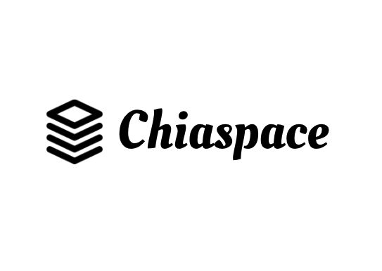

<p align='center'>
    
</p>

# Chiaspace

Converts any coin built on Chia to be treatable as a purchasable and tradeable NFT.

Built for the Build on Chia hackathon. Going after the 'Improved NFT' category.

Slides: https://docs.google.com/presentation/d/1Vb4PSAf5_2Hm5rlaL4zCIEeAncJ1iyX_QXR7_cytg_I/edit?usp=sharing

<!-- Demo:  -->

## Motivation

Platforms such as opensea exist for NFT discovery on ethereum-based platforms. This project can serve as an open source base for Chia NFTs.

End goal would be to host this as a project and begin accepting user uploads with payable addresses and shareable links.

- Increase adoption of non-ethereum based NFTs.
- Leverage Chia's representation of NFTs as coins to reduce friction in transferring and issuing new NFTs.
- Use low gas fees and underlying Chia protocol to increase coin-based NFT adoption.

## How it works

- Converts a chia coin into a tradeable NFT by attaching hosted image files.
- Stores entries for Chiaspace in a centralized DB for the marketplace (could be distributed storage potentially).
- Attaches pngs to Chia coin addresses / puzzle hashes using IPFS.
- Enable searching through existing coins based on name rather than puzzlehash.
- Underlying coins would still be instrumented / deployed via ChiaLisp.

## Challenges

- Running chia node locally for RPC calls (would be useful to have hosted tested url's similarly to infura).
- Integrating Chia wallet (in future work). Currently key would need to be provided to issue RPC calls directly.

## Future work

- Integrated wallet for sale / listing of Chia coin NFT entries (ideally similar to metamask).
- Wallet would need to natively recognize several different coin types.
- Integration with dedicated Chia node for RPC calls around transfer (via NodeJS chia-agent).
- Needs dedicated / hosted storage for searchable listings.
- Website hosting and marketing.

While not a ChiaLisp implementation, I hope this prototype qualifies for hackathon purposes around improving NFT! This project can otherwise be used as a free reference / idea base for other implementations.

## Screenshots

<!-- TODO -->

## Related projects:

- https://chiaforum.com/t/dfi-digital-farming-initiative-the-first-chia-nft-marketplace/12704

## Preview

```bash
$ npm install
$ npm start
```

or:

```bash
$ yarn
$ yarn start
```
