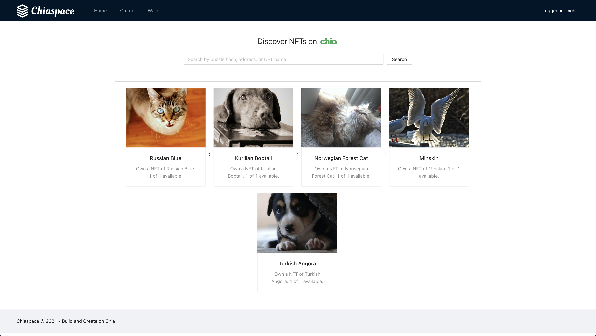
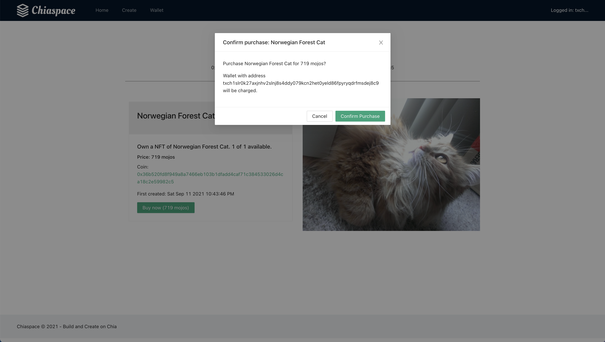
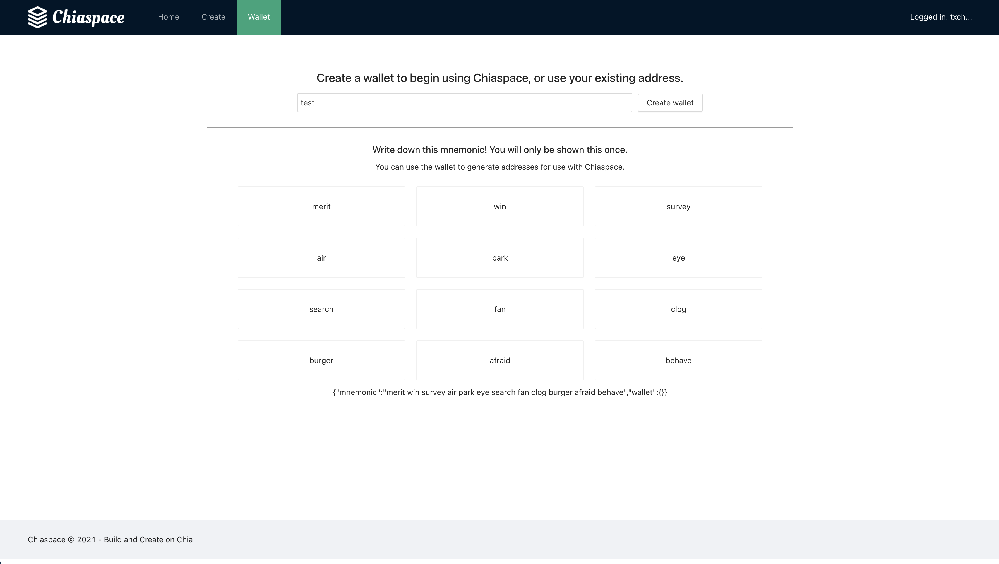

<p align='center'>
    
</p>
# Chiaspace

A marketplace for Chia coins backed by IPFS

Chiaspace is an app that converts coins built on Chia to be purchasable and tradeable as NFTs.

Built for the Build on Chia hackathon. Going after the 'Improved NFT' category.

<b>Note this project is currently for demo purposes only and requires logic to connect to Chia mainnet via RPC to be production-ready.</b>

Slides: https://docs.google.com/presentation/d/1Vb4PSAf5_2Hm5rlaL4zCIEeAncJ1iyX_QXR7_cytg_I/edit?usp=sharing

## Motivation

Platforms such as Opensea exist for NFT discovery on ethereum-based platforms, however these projects often have large gas fees that can inhibit usage. This project can serve as an open source base for a IPFS-based Chia NFT marketplace.

The end goal would be to host this project and accept user uploads with payable addresses and shareable links.

- Increase adoption of non-Ethereum based NFTs.
- Leverage Chia's representation of NFTs as coins to reduce friction in transferring and issuing new NFTs.
- Use low gas fees and underlying Chia protocol to increase coin-based NFT adoption.

## How it works

- Converts a chia coin into a tradeable NFT by attaching hosted image files.
  Stores entries for Chiaspace in a centralized DB for the marketplace (distributed storage could be another option).
- Attaches pngs to Chia coin addresses/puzzle hashes using IPFS.
- Enable searching through existing coins based on name rather than puzzle hash.
- Underlying coins would still be instrumented/deployed via ChiaLisp.

This app uses web3.storage for IPFS.

## Challenges

- Running chia node locally for RPC calls (would be helpful to have hosted test URLs similarly to Infura).
- Integrating Chia wallet (in future work) - Currently, the application would need a key to issue RPC calls directly.

## Future work

- Integrated wallet for sale/listing of Chia coin NFT entries (ideally similar to Metamask).
- Wallet would need to recognize several different coin types natively.
- Integration with dedicated Chia node for RPC calls around transfer (via NodeJS chia-agent).
- Needs dedicated/hosted storage for searchable listings.
- Website hosting and marketing.

While not a ChiaLisp implementation, I hope this prototype qualifies for hackathon purposes around improving NFT! Alternatively, this project is used as a free, open-source reference/idea base for other implementations.

<!-- Demo:
* NFT volume surge https://cointelegraph.com/news/opensea-trading-volume-explodes-76-240-ytd-amid-nft-boom
* NFT fees have never been higher
* Slides (intro chiaspace)
* Demo
- Existing NFT's
- Have an existing coin or puzzle hash
- Upload with a png or other asset
- Other users can purchase that coin from me, with the IPFS url tied to it
- Create wallet to accept or send payments to chia addresses
* End with github

-->

## Screenshots

<p align='center'>
    
    
    
    
    
    
    
    
</p>

## Related projects:

- https://chiaforum.com/t/dfi-digital-farming-initiative-the-first-chia-nft-marketplace/12704
- https://chiaforum.com/t/dfi-digital-farming-initiative-has-created-the-first-nft-on-chia/12902

## Preview

Add the following variable to your environment:
<pre>
  REACT_APP_STORAGE_KEY={WEB3_STORAGE_KEY} # web3.storage API key
</pre>

```bash
$ npm install
$ npm start
```

or:

```bash
$ yarn
$ yarn start
```
